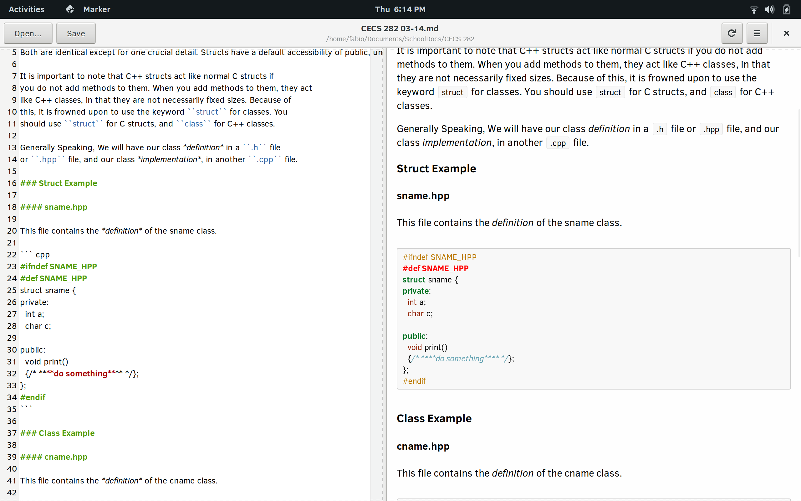
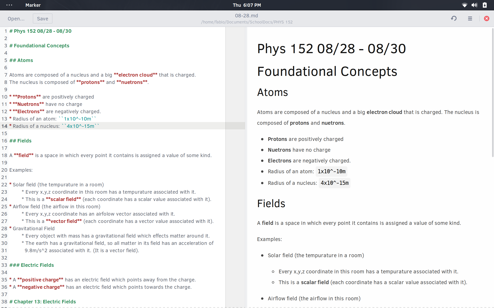
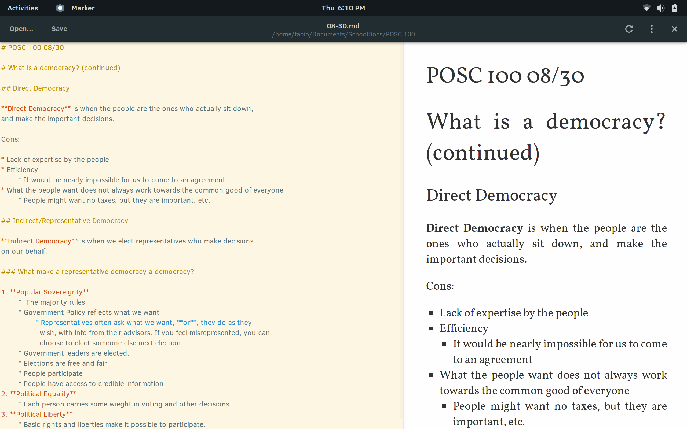
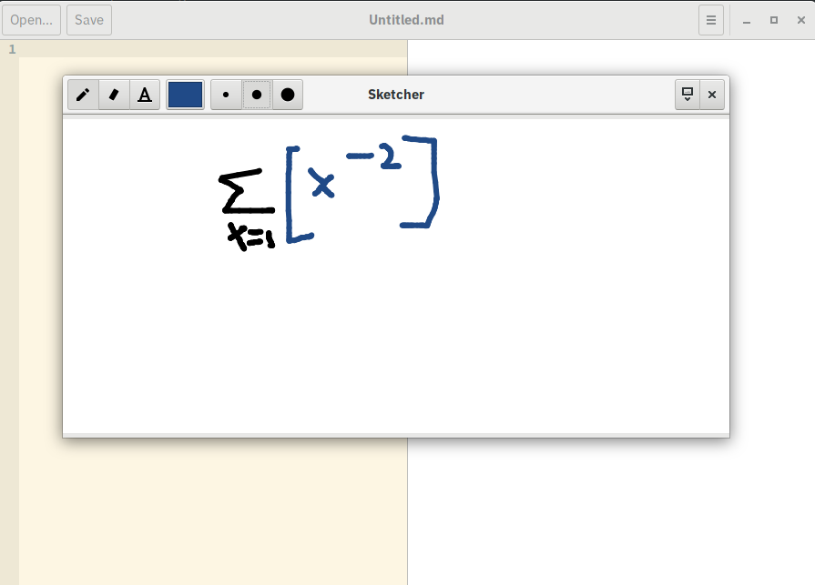
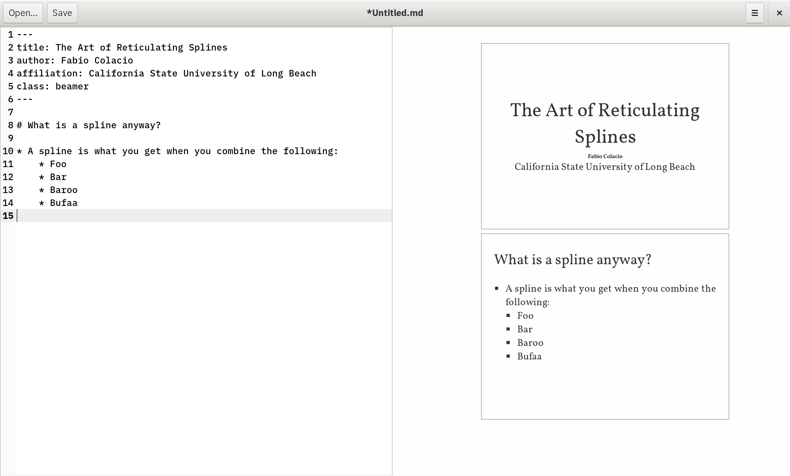

# Marker

Marker is a markdown editor for linux made with Gtk+-3.0

**Warning:** This app is still very early in development. There are many bugs and
unfinished features.

## Features

* View and edit markdown documents
* HTML and LaTeX conversion of markdown documents with [scidown](https://github.com/Mandarancio/scidown/)
  * Support for YAML headers
  * Document classes
  * Beamer/presentation mode (`class: beamer`)
  * Abstract sections
  * Table of Conents
  * External document inclusion
  * Equations, figures, table and listings with reference id and caption
  * Internal references
* Extra scientific syntax of SciDwon [wiki](https://github.com/Mandarancio/scidown/wiki/)
* TeX math rendering with [KaTeX](https://khan.github.io/KaTeX/)
* Support for [mermaid](https://mermaidjs.github.io/) diagrams
* Support for [charter](https://github.com/Mandarancio/charter/) for plot
* Syntax highlighting for code blocks with [highlight.js](https://highlightjs.org/)
* Integrated sketch editor
* Flexible export options with [pandoc](https://pandoc.org/)
  * PDF
  * RTF
  * ODT
  * DOCX
* Custom CSS themes
* Custom syntax themes
* Native Gtk+3 application

## Screenshots











## Packages

* [Flathub (thanks to @jsparber and @bertob)](https://beta.flathub.org/apps/details/com.github.fabiocolacio.marker)
* [Arch Linux (thanks to @mmetak)](https://aur.archlinux.org/packages/marker-git/)

## Installation From Source

### Dependencies

* meson >= 0.37.0 (install only)
* gtk3-devel >= 3.20
* gtksourceview3-devel
* webkitgtk4-devel
* pandoc
* gtkspell

### Build Instructions

**Note:** For a more stable experience, users are recommended download
[release tarball](https://github.com/fabiocolacio/Marker/releases) rather
than cloning from master.

```
$ git clone https://github.com/fabiocolacio/Marker.git
$ git submodule update --init --recursive
$ cd Marker
$ mkdir build && cd build
$ meson ..
$ ninja
$ sudo ninja install
```

## Donations/Tips

If you like Marker and would like to support the development of this project, please donate below!

[](https://www.paypal.me/fabiocolacio)
