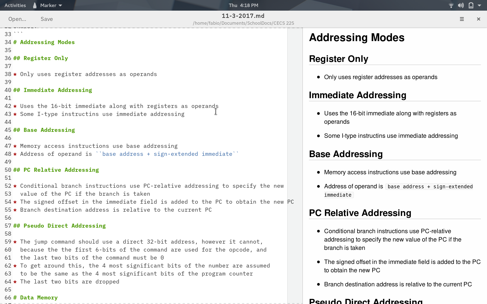
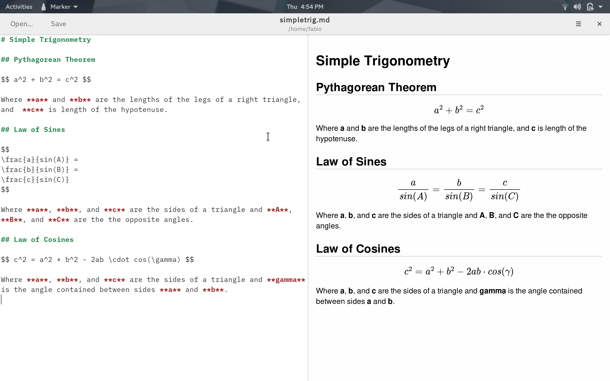
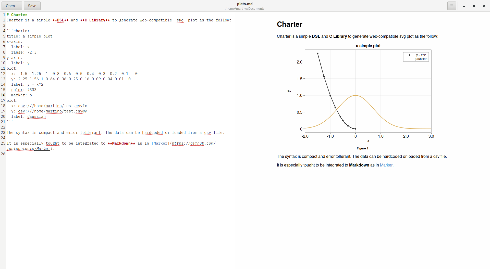
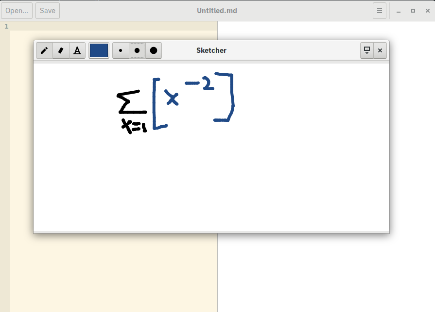
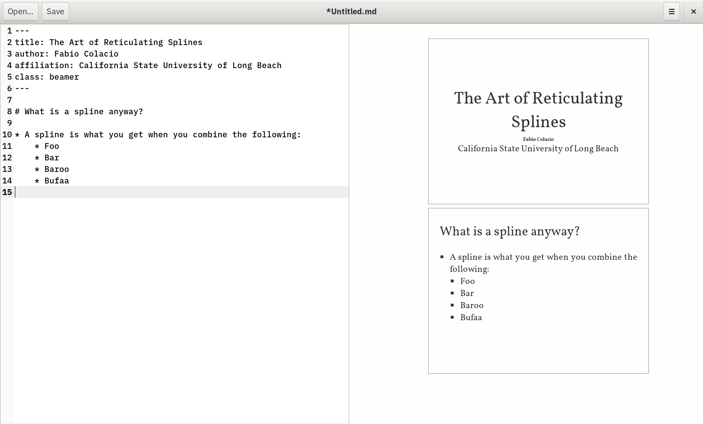

# Marker

Marker is a markdown editor for linux made with GTK+-3.0

**NOTE:** Issues regarding markdown parsing should go to the [scidown repo](https://github.com/mandarancio/scidown).

## Features

* View and edit markdown documents
* HTML and LaTeX conversion of markdown documents with [scidown](https://github.com/Mandarancio/scidown/)
  * Support for YAML headers
  * Document classes
  * Beamer/presentation mode (`class: beamer`)
  * Abstract sections
  * Table of Contents
  * External document inclusion
  * Equations, figures, table and listings with reference id and caption
  * Internal references
* Extra scientific syntax of SciDown on its [wiki](https://github.com/Mandarancio/scidown/wiki/)
* TeX math rendering with [KaTeX](https://khan.github.io/KaTeX/) or [MathJax](mathjax.org/)
* Support for [mermaid](https://mermaidjs.github.io/) diagrams
* Support for [charter](https://github.com/Mandarancio/charter/) for plotting
* Syntax highlighting for code blocks with [highlight.js](https://highlightjs.org/)
* Integrated sketch editor
* Flexible export options with [pandoc](https://pandoc.org/)
  * PDF
  * RTF
  * ODT
  * DOCX
* Custom CSS themes
* Custom syntax themes
* Native GTK+3 application

## Screenshots











## Packages

* [Fedora (thanks to @tim77)](https://src.fedoraproject.org/rpms/marker)
* [Flathub (thanks to @jsparber and @bertob)](https://flathub.org/apps/details/com.github.fabiocolacio.marker)
* [Arch Linux^AUR (thanks to @mmetak)](https://aur.archlinux.org/packages/marker-git/)
* [Arch Linux package (thanks to @City-busz)](https://www.archlinux.org/packages/community/x86_64/marker/)
* [Ubuntu PPA Stable (thanks to @apandada1 and @olivierb2)](https://launchpad.net/~apandada1/+archive/ubuntu/marker)
* [Ubuntu PPA Daily builds (thanks to @apandada1 and @olivierb2)](https://launchpad.net/~apandada1/+archive/ubuntu/marker-daily)
* [Snap Store](https://snapcraft.io/static/images/badges/en/snap-store-black.svg)](https://snapcraft.io/marker)


## Installation From Source

### Dependencies

* meson >= 0.37.0 (install only)
* gtk3-devel >= 3.20
* gtksourceview3-devel
* webkitgtk4-devel
* pandoc
* gtkspell
* itstool

### Build Instructions

**NOTE: MAKE SURE TO CLEAN THE EXTENSIONS BEFORE UPDATING: rm /usr/share/com.github.fabiocolacio.marker/extensions/**

**Note:** For a more stable experience, users are recommended download
[release tarball](https://github.com/fabiocolacio/Marker/releases) rather
than cloning from master.

```
$ git clone https://github.com/fabiocolacio/Marker.git
$ cd Marker
$ git submodule update --init --recursive
$ mkdir build && cd build
$ meson .. --prefix /usr
$ ninja
$ sudo ninja install
```

### Development/Testing (without installation)

To run Marker for development/testing without installing:

```bash
# After building with ninja:
$ GSETTINGS_SCHEMA_DIR=build ./build/marker

# Or use the provided wrapper script:
$ ./run-marker.sh
```

## Donations/Tips

If you like Marker and would like to support the development of this project, please donate below!

[](https://www.paypal.me/fabiocolacio)
