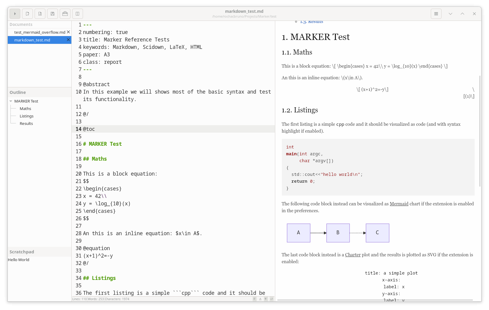

# Marker Features Overview

Marker is a comprehensive markdown editor for Linux built with GTK+3, offering a rich set of features for writing, editing, and publishing markdown documents.

## Core Editing Features

### Markdown Support
- **Full CommonMark support**: Complete implementation of the CommonMark specification
- **GitHub Flavored Markdown**: Support for GFM extensions including tables and task lists
- **Scientific markdown**: Extended syntax via [scidown](https://github.com/Mandarancio/scidown/) for academic writing
- **YAML headers**: Document metadata and configuration support
- **Document classes**: Beamer/presentation mode with `class: beamer`
- **Abstract sections**: Academic paper structure support

### Editor Interface
- **Syntax highlighting**: Code block highlighting with [highlight.js](https://highlightjs.org/)
- **Line numbers**: Optional line number display
- **Word wrap**: Configurable word wrapping
- **Spell checking**: Integrated spell checking with suggestions
- **Font customization**: Configurable editor font and size
- **Search and replace**: Find/replace functionality with regular expression support
- **Auto-save**: Automatic document saving
- **Undo/redo**: Full undo/redo history

## View Modes

### Layout Options
- **Editor Only**: Focus entirely on writing without distractions
- **Preview Only**: View rendered markdown without editor
- **Dual Pane Horizontal**: Side-by-side editor and preview
- **Dual Pane Vertical**: Editor above, preview below
- **Dual Window**: Editor and preview in separate windows

### View Controls
- **View mode cycling**: Ctrl+M to cycle through all modes
- **Scroll synchronization**: Optional synchronized scrolling between editor and preview
- **Zoom controls**: Adjustable preview zoom levels
- **Live preview**: Real-time rendering as you type

## Mathematical and Scientific Features

### Math Rendering
- **TeX math support**: Render mathematical expressions with LaTeX syntax
- **KaTeX integration**: Fast math rendering with [KaTeX](https://khan.github.io/KaTeX/)
- **MathJax support**: Alternative math rendering engine
- **Inline and display math**: Support for both `$inline$` and `$$display$$` math
- **Equations with references**: Numbered equations with cross-references

### Diagrams and Plotting
- **Mermaid diagrams**: Support for [mermaid](https://mermaidjs.github.io/) flowcharts, sequence diagrams, and more
- **Charter plotting**: Data visualization with [charter](https://github.com/Mandarancio/charter/)
- **Figure management**: Figures with captions and reference IDs
- **Table support**: Advanced table formatting and references

## User Interface Features

### Sidebar
- **Document outline**: Navigate document structure with automatic heading detection
- **Scratchpad**: Persistent note-taking area for quick thoughts and snippets
- **Collapsible design**: Hide/show sidebar with F9 or menu toggle
- **Smart navigation**: Click outline items to jump to document sections

### Menu and Navigation
- **Recent files**: Quick access to 10 most recently opened files
- **Comprehensive menus**: Full-featured menu system with keyboard shortcuts
- **Preferences window**: Centralized settings management
- **Keyboard shortcuts**: Extensive keyboard shortcuts for efficient workflow

### Themes and Customization
- **Dark/light themes**: Native GTK theme support
- **Custom CSS themes**: Apply custom styling to preview
- **Syntax themes**: Customizable code highlighting themes
- **Font configuration**: Adjustable editor fonts and sizes

## Export and Publishing

### Export Formats
- **PDF export**: High-quality PDF generation via Pandoc
- **HTML conversion**: Clean HTML output with scidown
- **LaTeX export**: Academic document preparation
- **RTF format**: Rich Text Format for word processors
- **ODT format**: OpenDocument Text for LibreOffice/OpenOffice
- **DOCX format**: Microsoft Word document format

### Export Features
- **Pandoc integration**: Flexible export via [pandoc](https://pandoc.org/)
- **Template support**: Custom export templates
- **Batch processing**: Command-line export capabilities
- **Quality preservation**: Maintain formatting and structure in exports

## Advanced Features

### Document Management
- **Multiple documents**: Tabbed interface for multiple open files
- **Session persistence**: Restore open documents between sessions
- **File associations**: System integration for markdown files
- **Directory opening**: Bulk open markdown files from directories

### Integrated Tools
- **Sketch editor**: Built-in drawing tool for diagrams and illustrations
- **Table insertion**: Visual table creation and editing
- **Link management**: Easy link insertion and validation
- **Image handling**: Drag-and-drop image insertion

### Scientific Writing
- **Bibliography support**: Citation management and references
- **Cross-references**: Internal document linking and references
- **Table of contents**: Automatic TOC generation
- **External document inclusion**: Include content from other files
- **Listing management**: Code listings with captions and references

## Technical Features

### Performance
- **WebKit2GTK preview**: Fast, accurate rendering engine
- **GtkSourceView editor**: Professional text editing component
- **Efficient parsing**: Fast markdown processing with scidown
- **Memory management**: Optimized resource usage

### Integration
- **Native GTK+3**: Full Linux desktop integration
- **D-Bus support**: System integration capabilities
- **File system monitoring**: Automatic reload on external changes
- **Clipboard integration**: Rich copy/paste support

### Accessibility
- **Keyboard navigation**: Full keyboard accessibility
- **Screen reader support**: Accessibility compliance
- **High contrast support**: Visual accessibility features
- **Customizable UI**: Adaptable interface for different needs

## Development and Extension

### Architecture
- **Modular design**: Clean, extensible codebase
- **Plugin system**: Extension capability for additional features
- **Meson build system**: Modern build configuration
- **Internationalization**: Multi-language support ready

### Standards Compliance
- **CommonMark specification**: Full standard compliance
- **XDG standards**: Linux desktop standards compliance
- **Unicode support**: Full international character support
- **Platform integration**: Native Linux desktop behavior

This comprehensive feature set makes Marker suitable for everything from simple note-taking to complex academic document preparation, providing a powerful yet accessible markdown editing experience on Linux.
