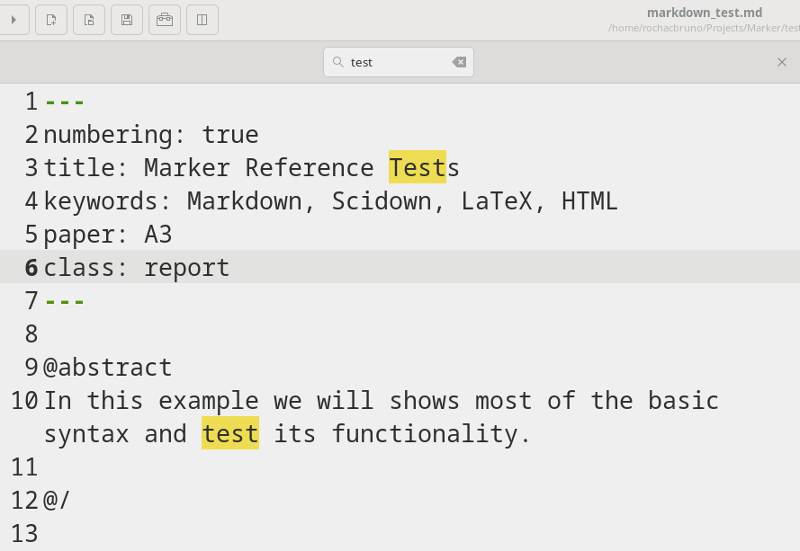

# Find and Replace

Marker provides comprehensive search and replace functionality to help you quickly locate and modify text throughout your documents. With support for case sensitivity, whole word matching, and regular expressions, you can perform simple searches or complex pattern-based replacements.




## Overview

The find and replace features include:
- **Quick find**: Simple search box for fast navigation
- **Find and replace**: Full dialog with replace capabilities
- **Search options**: Case sensitivity, whole words, regex
- **Navigation**: Jump between matches with ease
- **Bulk operations**: Replace all occurrences at once

## Find Feature

### Opening Find
- **Keyboard**: Press **Ctrl+F**
- **Edit Menu**: Edit → Find
- **Quick access**: Start typing after Ctrl+F

### Search Box Interface
The find bar appears at the bottom of the editor with:
- **Search field**: Enter text to find
- **Match counter**: Shows current match and total matches
- **Navigation buttons**: Previous/Next match
- **Options**: Case sensitive, whole word
- **Close button**: ESC or click X to close

### Navigation
- **Next match**: Enter or F3
- **Previous match**: Shift+Enter or Shift+F3
- **Highlight all**: All matches highlighted in editor
- **Current match**: Distinguished with different highlight

### Search Options

#### Case Sensitive
- Toggle with button or checkbox
- When enabled: "Test" ≠ "test"
- When disabled: "Test" = "test" = "TEST"

#### Whole Word
- Matches complete words only
- "test" won't match "testing" or "pretest"
- Useful for finding variable names

## Find and Replace

### Opening Replace Dialog
- **Keyboard**: Press **Ctrl+Shift+F** or **Ctrl+H**
- **Edit Menu**: Edit → Find and Replace

### Replace Dialog Interface
- **Find field**: Text to search for
- **Replace field**: Replacement text
- **Options**: Case, whole word, regex
- **Actions**: Find, Replace, Replace All
- **Scope**: Current document

### Replace Operations

#### Replace Single
1. Enter search text
2. Enter replacement text
3. Click "Find" to locate first match
4. Click "Replace" to replace and find next
5. Continue for each occurrence

#### Replace All
1. Enter search text
2. Enter replacement text
3. Click "Replace All"
4. Confirmation shows number of replacements

### Smart Replace
- **Preserve case**: Option to maintain original case
- **Undo support**: Ctrl+Z reverses all replacements
- **Preview**: See matches before replacing

## Regular Expressions

### Enabling Regex
- Check "Regular expression" option
- Changes search to pattern matching
- Powerful but requires regex knowledge

### Common Patterns

#### Basic Patterns
```regex
\d+        # Match one or more digits
\w+        # Match word characters
\s+        # Match whitespace
[A-Z]+     # Match uppercase letters
```

#### Useful Examples
```regex
^#+\s      # Match markdown headers
\[.*?\]    # Match markdown links
^\s*$      # Match empty lines
\b\w{5}\b  # Match 5-letter words
```

### Regex Replace

#### Capture Groups
Search: `(\w+)@(\w+)\.com`
Replace: `$1 at $2 dot com`

Transforms: `user@example.com` → `user at example dot com`

#### Advanced Examples

**Add quotes around words:**
- Search: `\b(\w+)\b`
- Replace: `"$1"`

**Convert headers:**
- Search: `^## (.+)$`
- Replace: `### $1`

**Clean up spacing:**
- Search: `\s+`
- Replace: ` ` (single space)

## Practical Use Cases

### Document Editing

#### Terminology Updates
Replace outdated terms:
- Find: "web site"
- Replace: "website"

#### Consistency Fixes
Standardize formatting:
- Find: "e-mail"
- Replace: "email"

### Markdown Specific

#### Update Link Formats
Convert reference links to inline:
- Find: `\[([^\]]+)\]\[([^\]]+)\]`
- Replace: `[$1](link-$2.html)`

#### Header Level Adjustment
Demote all headers by one level:
- Find: `^(#+)`
- Replace: `#$1`

#### List Style Conversion
Change bullet style:
- Find: `^\* `
- Replace: `- `

### Code Documentation

#### Variable Renaming
Update variable names:
- Find: `\boldName\b`
- Replace: `newName`
- Use "Whole word" option

#### Comment Formatting
Standardize comments:
- Find: `//TODO:`
- Replace: `// TODO:`

## Tips and Tricks

### Efficient Searching
- **Start broad**: Search partial text first
- **Refine with options**: Add case/whole word as needed
- **Use shortcuts**: F3 for quick next match
- **Close when done**: ESC to return focus to editor

### Safe Replacing
- **Preview first**: Use Find before Replace All
- **Test pattern**: Try regex on small section first
- **Backup important files**: Before major replacements
- **Use undo**: Ctrl+Z reverses replace operations

### Performance
- **Large files**: Regex can be slower
- **Simple when possible**: Use plain text search when adequate
- **Incremental search**: Results update as you type
- **Cancel long operations**: ESC to abort

## Advanced Features

### Search History
- Recent searches remembered
- Access with down arrow in search field
- Clears on application restart
- Speeds up repeated searches

### Multi-line Search
- Paste multi-line text to search
- Useful for finding code blocks
- Works with replace operations
- Regex `\n` for newlines

### Search Scope
- Currently document only
- Cannot search across multiple files
- Use file manager for project-wide search
- Consider external tools for bulk operations

## Keyboard Shortcuts Summary

| Action | Shortcut |
|--------|----------|
| Find | Ctrl+F |
| Find and Replace | Ctrl+Shift+F |
| Find Next | F3 or Enter |
| Find Previous | Shift+F3 |
| Close Search | ESC |
| Toggle Case Sensitive | Alt+C (in dialog) |
| Toggle Whole Word | Alt+W (in dialog) |
| Toggle Regex | Alt+R (in dialog) |

## Common Issues

### Not Finding Matches
- Check case sensitivity setting
- Verify whole word option
- Look for extra spaces
- Consider special characters

### Regex Not Working
- Verify regex option enabled
- Check pattern syntax
- Escape special characters
- Test pattern online first

### Performance Problems
- Simplify complex regex
- Search shorter text first
- Close other applications
- Break large documents

## Best Practices

### Document Maintenance
- Regular terminology updates
- Consistent formatting checks
- Link validation
- Spell check complement

### Workflow Integration
- Learn keyboard shortcuts
- Use find for navigation
- Replace for bulk edits
- Combine with other features

The find and replace functionality in Marker provides powerful text manipulation capabilities while maintaining the simplicity needed for everyday editing tasks, making it an essential tool for efficient document management.