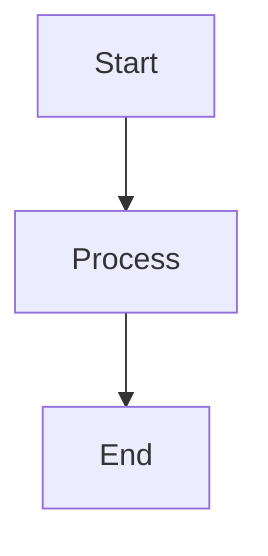
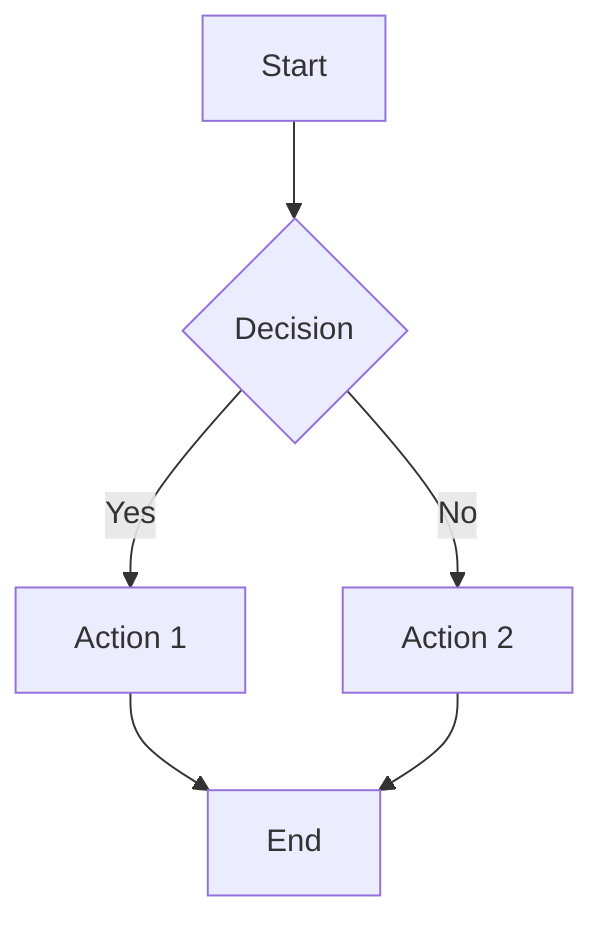
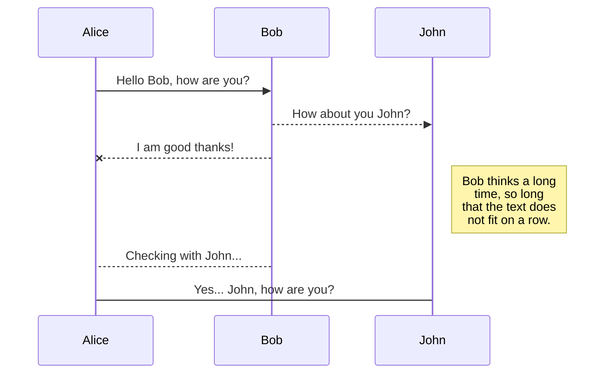
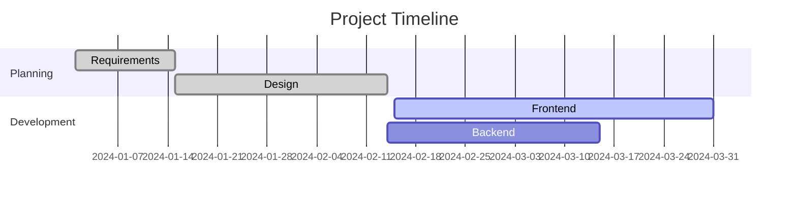
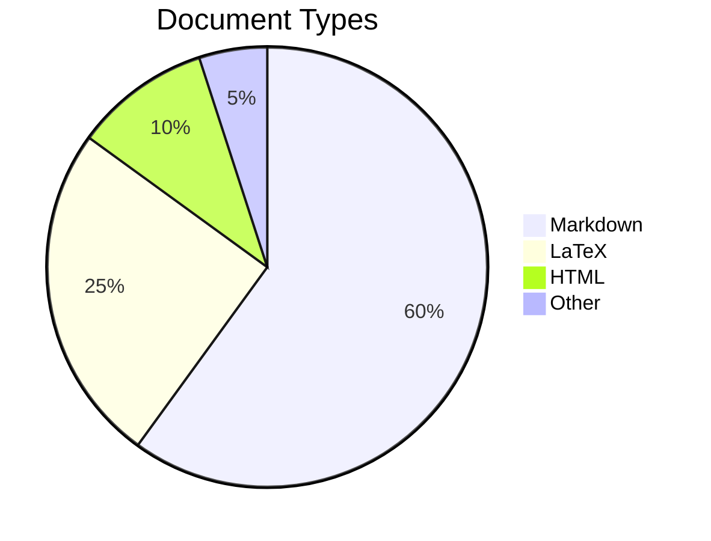
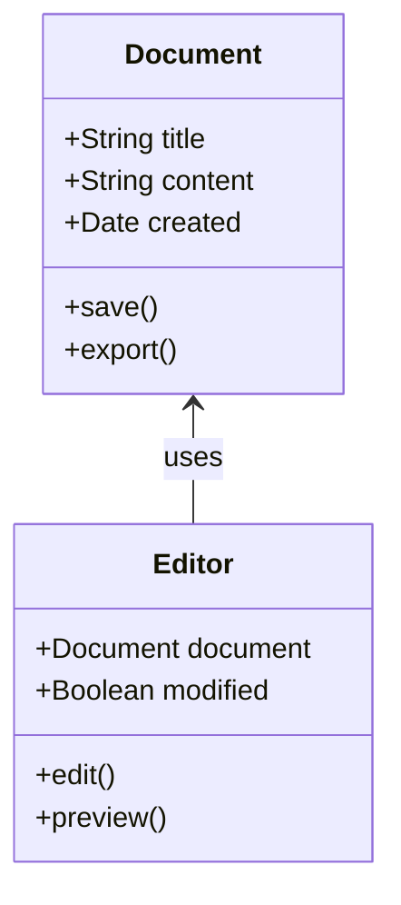
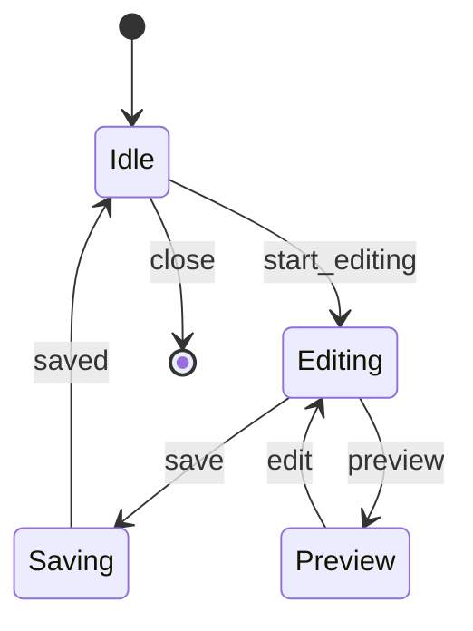
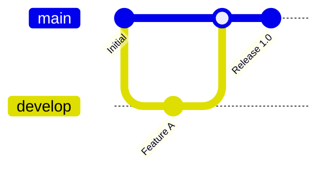
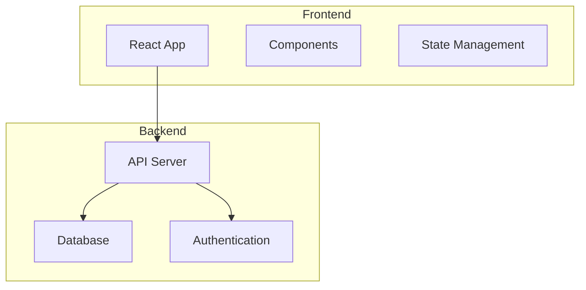
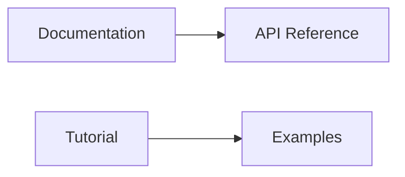

# Mermaid Diagrams

Marker supports [Mermaid](https://mermaidjs.github.io/) diagrams, allowing you to create professional flowcharts, sequence diagrams, Gantt charts, and more using simple text-based syntax. Mermaid diagrams are rendered directly in the preview and exported to all output formats.

## Overview

Mermaid diagrams are created using code blocks with the `mermaid` language identifier. The diagrams are rendered in real-time in the preview and maintained in exports, making them perfect for documentation, presentations, and technical writing.

## Basic Syntax

Create a Mermaid diagram by using a code block with `mermaid` as the language:

````markdown

````

## Diagram Types

### Flowcharts

Create flowcharts to represent processes and decision flows:



````markdown

````

### Sequence Diagrams

Model interactions between different entities over time:



````markdown

````

### Gantt Charts

Create project timelines and schedules:




````markdown

````

### Pie Charts

Display data proportions and percentages:



````markdown

````

### Class Diagrams

Model object-oriented designs and relationships:



````markdown

````

### State Diagrams

Represent state transitions and system behavior:



````markdown

````

### Git Graphs

Visualize Git branch and merge workflows:



````markdown
```mermaid
gitgraph
    commit id: "Initial"
    branch develop
    checkout develop
    commit id: "Feature A"
    checkout main
    merge develop
    commit id: "Release 1.0"
```
````

## Advanced Features

### Subgraphs

Group related elements in flowcharts:



### Styling and Themes

Mermaid diagrams automatically adapt to Marker's theme settings:
- **Light mode**: Clean, professional appearance
- **Dark mode**: Dark background with light elements
- **Custom themes**: Integration with Marker's CSS themes

### Links and Click Events

Add interactivity to your diagrams:



## Configuration

### Enabling Mermaid

Mermaid support is enabled by default in Marker. You can control it through:

- **Preferences**: Enable/disable Mermaid rendering
- **Export options**: Include Mermaid in exported documents

### Performance

- **Real-time rendering**: Diagrams update as you type
- **Efficient processing**: Optimized for large documents with multiple diagrams
- **Export compatibility**: Diagrams are preserved in all export formats

## Best Practices

### Diagram Design

- **Keep it simple**: Use clear, concise labels
- **Logical flow**: Arrange elements in a natural reading order
- **Consistent styling**: Use similar shapes for similar concepts
- **Adequate spacing**: Ensure diagrams are not cluttered

### Documentation Integration

- **Context**: Provide explanatory text around diagrams
- **Progressive disclosure**: Start with overview, add detail as needed
- **Version control**: Mermaid diagrams are text-based and diff-friendly
- **Accessibility**: Include alt text descriptions for complex diagrams

### Performance Tips

- **Moderate complexity**: Very complex diagrams may impact performance
- **Multiple smaller diagrams**: Better than one huge diagram
- **Test rendering**: Preview diagrams during creation
- **Export testing**: Check diagram appearance in exported formats

## Troubleshooting

### Common Issues

- **Syntax errors**: Check Mermaid syntax carefully
- **Rendering problems**: Verify Mermaid is enabled in preferences
- **Export issues**: Ensure diagrams render correctly in preview first
- **Performance**: Simplify overly complex diagrams

### Syntax Validation

- Use Mermaid's online editor for testing complex syntax
- Check the [official Mermaid documentation](https://mermaidjs.github.io/) for syntax reference
- Validate diagrams in Marker's preview before finalizing

## Examples and Use Cases

### Software Documentation

- System architecture diagrams
- API workflow illustrations
- Database relationship models
- User journey maps

### Project Management

- Process flowcharts
- Timeline visualizations
- Responsibility matrices
- Decision trees

### Academic and Research

- Experimental procedures
- Data flow diagrams
- Conceptual models
- Research methodologies

Mermaid diagram support in Marker provides a powerful way to create professional visualizations directly within your markdown documents, enhancing both the writing experience and the final output quality.
