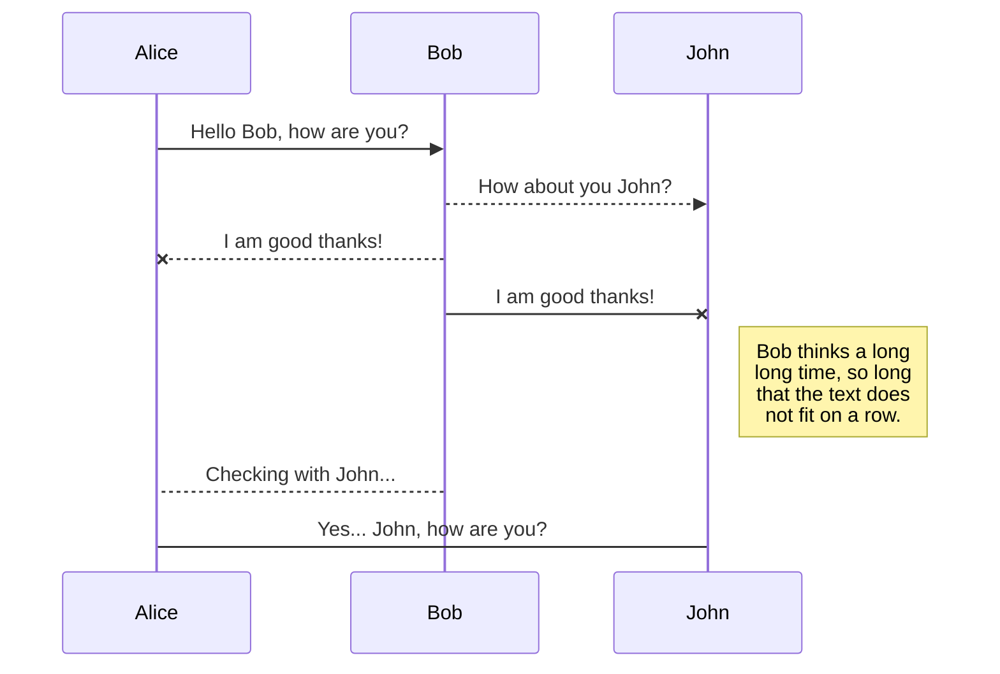
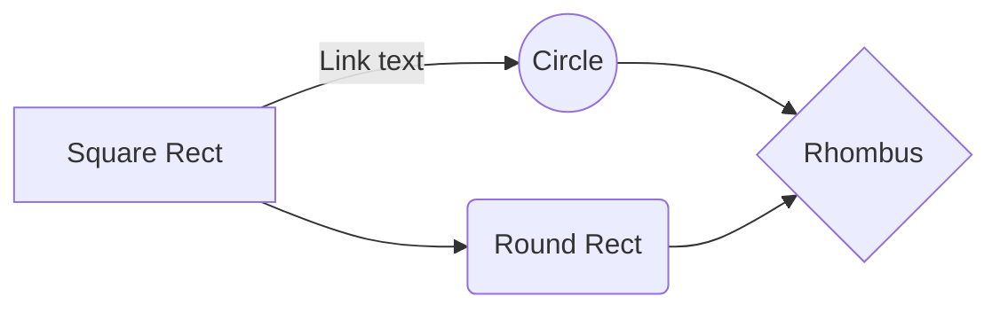
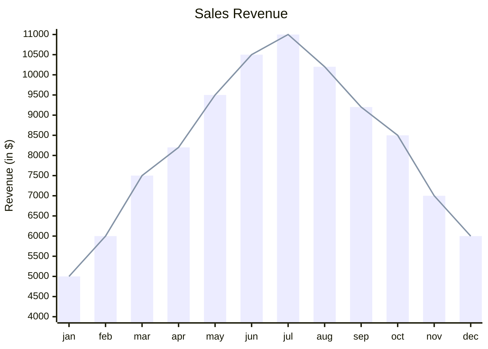
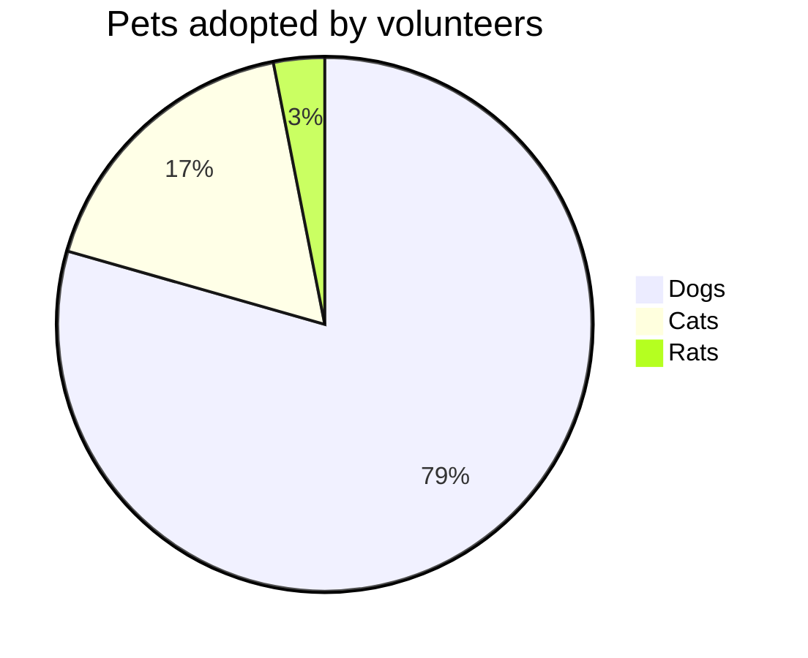
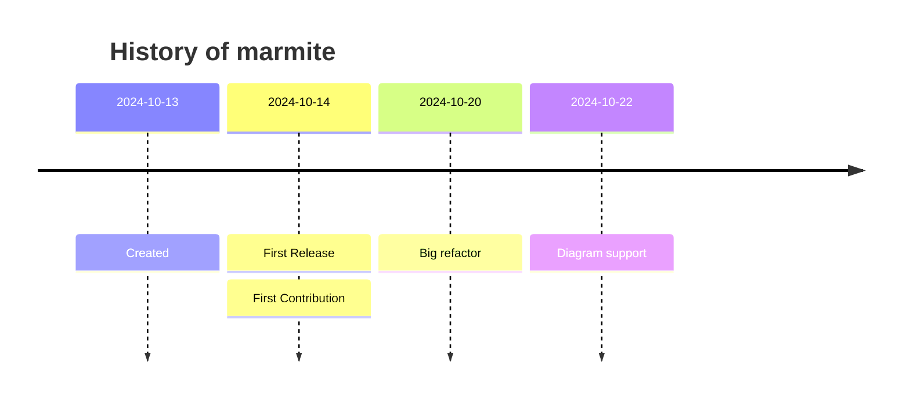

# Title of the post

This post must be written following marmite markdown syntax,
marmite follows CommonMark and Github Flavoured Markdown + extensions.

## Common Markdown

The content on Marmite accepts any valid `CommonMark` or **Github** _Flavoured_ markdown
and some `GFM` extensions, Marmite also does post processing of HTML to support features such as 
back-links and Obsidian links.


### Paragraphs and formatting

Simple paragraph and usual formatting like **bold**, __underline__, *italic*
and also all sorts of formatting elements, as follows.

```markdown
**bold**, __underline__, *italic*
```

### Strike-through

The following is ~~no more~~.

```markdown
The following is ~~no more~~.
```

### Table

| Syntax      | Description                                                  |
| ----------- | ------------------------------------------------------------ |
| Header      | Title                                                        |
| List        | Here's a list! <ul><li>Item one.</li><li>Item two.</li></ul> |

```markdown
| Syntax      | Description |
| ----------- | ----------- |
| Header      | Title |
| List        | Here's a list! <ul><li>Item one.</li><li>Item two.</li></ul> |
```

### Footnotes

Here is a simple footnote[^1]. With some[^2] additional text after it.  

A reference[1] can also be used to just create a link hidden from footnotes.

```markdown
Here is a simple footnote[^1]. With some[^2] additional text after it.  

A reference[1] can also be used to just create a link hidden from footnotes.
```

And on the end of the file:

```markdown
[^1]: My footnote.
[^2]: Another footnote.
[1]: <https://en.wikipedia.org/wiki/Hobbit#Lifestyle> "Hobbit lifestyles"
```

> [!TIP]  
> Add global references to the `_references.md` file to reuse on any content.

### Block quote

>Not a quote
> quote
> > > Nested quote

```markdown
>Not a quote
> quote
> > > Nested quote
```

Multiline quote

>>>
"Marmite is the easiest SSG" created by
Bruno Rocha with the contribution of various people.
>>>

```markdown
>>>
"Marmite is the easiest SSG" created by
Bruno Rocha with the contribution of various people.
>>>
```

Multi paragraph quote 

> Dorothy followed her through many of the beautiful rooms in her castle.
> 
> The Witch bade her clean the pots and kettles and sweep the floor and keep the fire fed with 

```markdown
> Dorothy followed her through many of the beautiful rooms in her castle.
> 
> The Witch bade her clean the pots and kettles and sweep the floor and keep the fire fed with 
```

Rich quotes

> **The quarterly results look great!**
> 
> - Revenue was off the chart.
> - Profits were higher than ever.
> 
>  *Everything* is going according to **plan**.

```markdown
> **The quarterly results look great!**
> 
> - Revenue was off the chart.
> - Profits were higher than ever.
> 
>  *Everything* is going according to **plan**.
```

### Underline

__dunder__

```markdown
__dunder__
```

### Code

```python
import antigravity

def main():
    print("Python is a great language")
```

```rust
fn main() {
    println!("Marmite is made with Rust!");
}
```
````markdown
```python
import antigravity

def main():
    print("Python is a great language")
```

```rust
fn main() {
    println!("Marmite is made with Rust!");
}
```
````

### lists

- lists
  - sub item
- images
  * other
- tables
- Formatting
```markdown
- lists
  - sub item
- images
  * other
- tables
- Formatting
```

Numbered

1. First item
1. Second item
    - Indented unordered item
    - Indented unordered item
1. Third item
    1. Indented ordered item
    1. Indented ordered item
1. Fourth item 

```markdown
1. First item
1. Second item
    - Indented unordered item
    - Indented unordered item
1. Third item
    1. Indented ordered item
    1. Indented ordered item
1. Fourth item 
```

Starting lists with numbers requires a `number\`

- 1983\. A great year!
- I think 1984 was second best. 

```markdown
- 1983\. A great year!
- I think 1984 was second best. 
```

### Images

Photo  


Same but containing a tooltip if you hover the mouse on  


```markdown
Photo  


Same but containing a tooltip if you hover the mouse on  

```

---

## Creating Links

### Regular link

[Marmite](https://github.com/rochacbruno/marmite)  

[A link with a tooltip](https://pudim.com.br "A picture of a pudim")  

```markdown
[Marmite](https://github.com/rochacbruno/marmite)

[A link with a tooltip](https://pudim.com.br "A picture of a pudim")  
```

### Auto-link

https://github.com/rochacbruno/marmite  
<https://www.markdownguide.org>  
<fake@example.com>

```markdown
https://github.com/rochacbruno/marmite  
<https://www.markdownguide.org>  
<fake@example.com>
```

### Wikilinks 

Wikilinks allows to link using `[[name|url]]` syntax.

[[Read the Tutorial|getting-started]] and [[Read the Tutorial|getting-started.md]] and [[Read the Tutorial|getting-started.html]]  

Anchors also supported [[FAQ|about#faq]]

[[Pudim|https://pudim.com.br]]

It also resolve anchors like [[Wikilinks|#wikilinks]]  
and internal content by title like 
[[MD Wikilinks|Markdown Format#Wikilinks]] or [[MD Format|Markdown Format]]

```markdown
[[Read the Tutorial|getting-started]] and [[Read the Tutorial|getting-started.md]] and [[Read the Tutorial|getting-started.html]]

[[Pudim|https://pudim.com.br]]

It also resolve anchors like [[Wikilinks|#wikilinks]]  
and internal content by title like 
[[MD Wikilinks|Markdown Format#Wikilinks]] or [[MD Format|Markdown Format]]

```

### Obsidian Links

Obsidian links are made using `[[page-slug]]` or `[[page-slug.md]]`

Example:

[[about]] and [[about.md]] and [[about.html]] should point both to the about page.

Anchors also supported [[about#faq]]

[[https://pudim.com.br]]

It also resolve anchors like [[#Obsidian Links]]  
and internal content by title like  
[[Markdown Format#Obsidian Links]] or [[Markdown Format]]

```markdown
[[about]] and [[about.md]] and [[about.html]] should point both to the about page.

Anchors also supported [[about#faq]]

[[https://pudim.com.br]]

It also resolve anchors like [[#Obsidian Links]]  
and internal content by title like 
[[Markdown Format#Obsidian Links]] or [[Markdown Format]]

```

> [!NOTE]  
> If you want to use Obsidian links with display text like in `[[link|display text]]` check
> how the options `wikilinks_title_before_pipe` and `wikilinks_title_after_pipe` on [[Configurable Markdown Parser Options]]

### Back-links

Every time you link to another page or post
using the backreference like `{slug}`, `{slug}.md` or `{slug}.html`
**marmite** will track the backlinking and show
a list of pages that links to each other.

Examples:

[[hello]]
[Hello1](hello.html)
[Hello2](hello.md)
[[Hello3|hello]]
[[Hello4|hello.md]]
<a href="hello.html">Hello5</a>

```markdown
[[hello]]
[Hello1](hello.html)
[Hello2](hello.md)
[[Hello3|hello]]
[[Hello4|hello.md]]
<a href="hello.html">Hello5</a>
```

In any case the `hello.html` page will have a this page
on its list of back-links:

<figure>
  <figcaption>Menu</figcaption>
  
</figure>

---

## Extensions

### Task

- [x] Task 1
- [ ] Task 2

```markdown
- [x] Task 1
- [ ] Task 2
```

### Emoji

:smile: - :crab: - :snake:

```markdown
:smile: - :crab: - :snake:
```

### Description lists

First term
: Details for the **first term**

Second term
: Details for the **second term**
: More details in second paragraph.

```markdown
First term
: Details for the **first term**

Second term
: Details for the **second term**
: More details in second paragraph.
```

### Spoiler 

This is ||secret||

```markdown
This is ||secret||
```

### Math

> Depends on `extra: {"math": true}` defined on frontmatter, then **MathJax** is loaded.

When $a \ne 0$, there are two solutions to \\(ax^2 + bx + c = 0\\) and they are
$$x = {-b \pm \sqrt{b^2-4ac} \over 2a}.$$

Inline math $1 + 2$ and display math $$x + y$$

$$
x^2
$$

```html
When $a \ne 0$, there are two solutions to \\(ax^2 + bx + c = 0\\) and they are
$$x = {-b \pm \sqrt{b^2-4ac} \over 2a}.$$

Inline math $1 + 2$ and display math $$x + y$$

$$
x^2
$$
```

### Alerts

Github Flavored Markdown (GFM) supports alerts, also called callouts or admonitions.

> [!NOTE]  
> Highlights information that users should take into account, even when skimming.

> [!TIP]
> Optional information to help a user be more successful.

> [!IMPORTANT]  
> Crucial information necessary for users to succeed.

> [!WARNING]  
> Critical content demanding immediate user attention due to potential risks.

> [!CAUTION]
> Negative potential consequences of an action.


```markdown
> [!NOTE]  
> Highlights information that users should take into account, even when skimming.

> [!TIP]
> Optional information to help a user be more successful.

> [!IMPORTANT]  
> Crucial information necessary for users to succeed.

> [!WARNING]  
> Critical content demanding immediate user attention due to potential risks.

> [!CAUTION]
> Negative potential consequences of an action.
```

Optionally a title can be added to the alert:

> [!NOTE] For your attention
> Highlights information that users should take into account, even when skimming.

```markdown
> [!NOTE] For your attention
> Highlights information that users should take into account, even when skimming.
```


### Diagrams

> Depends on `extra: {"mermaid": true}` defined on frontmatter, then **MermaidJS** is loaded.
>  
> `mermaid_theme` is also configurable with values `forest`,`neutral`,`dark`,`forest`,`base`,`default`











<details>
<summary> Click to see the raw mermaid </summary>

````markdown


````

</details>

---

## HTML

> All **raw** html is allowed

### Superscript

80<sup>2</sup>

```html
80<sup>2</sup>
```

### Embed

Just use raw HTML for now, in future we may have a shorcode.

```html
<iframe width="260" height="160" src="https://www.youtube.com/embed/MjrBTcnnK6c?si=PmQWsGiTh5XguSpb" title="YouTube video player"></iframe>
```

### Pico CSS components

<small>The default embedded template uses [picocss](https://picocss.com) so it is possible to write raw HTML like this:</small>

#### FAQ

<details>
<summary>Why is it named Marmite?</summary>

The creator of this project was looking for some cool name
to use for a **mark**down related project.
Then while having bread with Marmite spread for breakfast
it looked like a good idea!

</details>

<hr />

<details>
<summary>Why Rust?</summary>

**Why not?**

</details>

<hr />


```html
<details>
<summary>Why is it named Marmite?</summary>

The ...

</details>

<hr />

<details>
<summary>Why Rust?</summary>

**Why not?**

</details>

<hr />

```

### Symbols


    Copyright (©) — &copy;
    Registered trademark (®) — &reg;
    Trademark (™) — &trade;
    Euro (€) — &euro;
    Left arrow (←) — &larr;
    Up arrow (↑) — &uarr;
    Right arrow (→) — &rarr;
    Down arrow (↓) — &darr;
    Degree (°) — &#176;
    Pi (π) — &#960;

This is a &copy;left material.

```markdown
This is a &copy;left material.
```

Bye!


[^1]: My footnote.
[^2]: Another footnote.
[1]: <https://en.wikipedia.org/wiki/Hobbit#Lifestyle> "Hobbit lifestyles"
