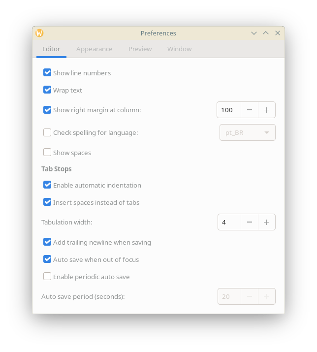

# Preferences

Marker offers extensive customization options through its preferences window, allowing you to tailor the editor to your specific needs and workflow. Access preferences through the gear menu (⚙️) → **Preferences**.

## Editor Preferences

The Editor tab contains settings that affect the markdown editing experience.

### Text Editing Options

#### Replace Tabs with Spaces
- **Default**: Enabled
- **Function**: Converts tab characters to spaces
- **Benefit**: Consistent formatting across different editors

#### Tab Width
- **Range**: 1-8 spaces
- **Default**: 4 spaces
- **Usage**: Number of spaces inserted when tab key is pressed

#### Auto Indent
- **Default**: Enabled
- **Function**: Automatically indents new lines based on previous line
- **Benefit**: Maintains code block and list formatting

#### Show Spaces
- **Default**: Disabled
- **Function**: Displays dots for space characters
- **Usage**: Helpful for identifying whitespace issues

### Visual Settings

#### Show Line Numbers
- **Default**: Enabled
- **Function**: Displays line numbers in the editor margin
- **Toggle**: Also available via toolbar button

#### Show Right Margin
- **Default**: Disabled
- **Function**: Shows vertical line at specified column
- **Configuration**: Set position with "Right margin at column"

#### Right Margin at Column
- **Range**: 1-500
- **Default**: 80
- **Usage**: Visual guide for line length limits

#### Highlight Current Line
- **Default**: Enabled
- **Function**: Highlights the line containing cursor
- **Benefit**: Easier cursor tracking in long documents

### Editing Behavior

#### Enable Text Wrapping
- **Default**: Enabled
- **Function**: Wraps long lines to fit in window
- **Toggle**: Also available via toolbar button

#### Enable Spell Check
- **Default**: Enabled
- **Function**: Underlines misspelled words
- **Languages**: Uses system spell check dictionaries
- **Toggle**: F7 or toolbar button

#### Add Trailing New Line
- **Default**: Enabled
- **Function**: Ensures files end with newline character
- **Benefit**: Better compatibility with version control

#### Scroll Past End
- **Default**: Enabled
- **Function**: Allows scrolling beyond last line
- **Benefit**: Comfortable editing at document end

### Syntax and Theme

#### Syntax Highlighting Language
- **Default**: Markdown
- **Options**: Various programming languages
- **Function**: Enables appropriate syntax highlighting

#### Syntax Highlighting Style
- **Options**: Multiple color schemes
- **Examples**: Classic, Cobalt, Kate, Oblivion, Solarized Dark/Light, Tango
- **Preview**: Changes apply immediately

## Font Preferences

Font settings control the typography in the editor.

### Editor Font Settings

#### Enable Custom Font
- **Default**: Enabled
- **Function**: Allows font customization instead of system default

#### Editor Font
- **Type**: Font picker dialog
- **Default**: System monospace font
- **Options**: All installed monospace fonts
- **Preview**: Sample text shows selected font

#### Editor Font Size
- **Range**: 6-72 points
- **Default**: 12 points
- **Adjustment**: Spin button or direct entry
- **Live Update**: Changes apply to all open editors

### Font Features
- **Monospace fonts only**: Ensures code alignment
- **System font fallback**: Uses system default if custom disabled
- **Per-user settings**: Each user can have different fonts
- **Font rendering**: Respects system anti-aliasing settings

## Preview Preferences

Preview settings control the rendered markdown display.

### CSS Theme

#### Preview CSS Theme
- **Options**: Multiple built-in themes
- **Examples**: 
  - GitHub styles (GitHub2, GitHub Dark)
  - Academic styles (scidown_article, scidown_report)
  - Presentation style (beamer)
  - Modern styles (Swiss, Foghorn, Nord)
- **Custom themes**: Can add CSS files to themes directory
- **Live preview**: Changes apply immediately

### Rendering Options

#### KaTeX/MathJax Toggle
- **Default**: KaTeX enabled
- **Options**: KaTeX (fast) or MathJax (comprehensive)
- **Function**: Mathematical equation rendering
- **Usage**: For documents with LaTeX math

#### Enable Highlighting for Code Blocks
- **Default**: Enabled
- **Function**: Syntax highlighting in code blocks
- **Engine**: highlight.js
- **Languages**: Automatic detection or manual specification

#### Mermaid Diagrams
- **Default**: Enabled
- **Function**: Renders mermaid diagram code blocks
- **Types**: Flowcharts, sequence diagrams, Gantt charts
- **Performance**: May impact preview speed for many diagrams

### Preview Behavior

#### Enable Scroll Synchronization
- **Default**: Enabled
- **Function**: Syncs scroll position between editor and preview
- **Modes**: Works in dual pane (horizontal and vertical)
- **Smart sync**: Maintains relative position

## Window Preferences

Window settings control application behavior and layout.

### View Settings

#### Default View Mode
- **Options**: 
  - Editor Only
  - Preview Only
  - Dual Pane
  - Dual Pane Vertical
  - Dual Window
- **Default**: Dual Pane
- **Application**: Used for new windows and files

#### Enable Experimental Preview Position Synchronization
- **Default**: Disabled
- **Function**: Advanced scroll sync algorithm
- **Status**: Experimental feature
- **Usage**: Try if standard scroll sync insufficient

### Sidebar Settings

#### Show Sidebar on Startup
- **Default**: Disabled
- **Function**: Automatically shows sidebar when opening Marker
- **Contents**: Outline and scratchpad

#### Show Scratchpad
- **Default**: Enabled
- **Function**: Shows scratchpad area in sidebar
- **Toggle**: Ctrl+Alt+S

### Window Behavior

#### Dark Mode
- **Default**: Follow system
- **Function**: Uses GTK dark theme
- **Application**: Affects entire application UI

#### Remember Window State
- **Default**: Enabled
- **Function**: Saves window size and position
- **Restoration**: Applied on next launch

### Auto-Save Settings

#### Auto Save on Focus Out
- **Default**: Enabled
- **Function**: Saves when window loses focus
- **Benefit**: Natural save points

#### Auto Save Periodically
- **Default**: Enabled
- **Function**: Saves at regular intervals
- **Interval**: Configurable period

#### Auto Save Period
- **Range**: 10-600 seconds
- **Default**: 300 seconds (5 minutes)
- **Optimization**: Balance between safety and performance

## Applying Changes

### Immediate Changes
Most preferences apply immediately:
- Font changes
- Theme selections
- Visual toggles
- Editor behaviors

### Restart Required
Some changes need application restart:
- Certain rendering engine changes
- Deep system integration settings

### Per-Document Settings
Some settings can be overridden per document:
- View mode (temporary)
- Zoom level (temporary)

## Preferences Storage

### Location
- **Linux**: `~/.config/marker/`
- **Format**: GSettings/dconf database
- **Backup**: Can export/import settings

### Reset to Defaults
- Individual settings: Use default values shown
- Complete reset: Delete configuration directory
- Safe mode: Launch with clean profile for testing

## Tips and Best Practices

### For New Users
1. Start with defaults
2. Adjust font size first if needed
3. Try different CSS themes
4. Enable features gradually

### For Academic Writing
- Enable KaTeX/MathJax
- Use scidown themes
- Enable trailing newline
- Consider longer auto-save intervals

### For Code Documentation
- Enable line numbers
- Show right margin at 80
- Use syntax highlighting
- Enable scroll past end

### For Note Taking
- Enable spell check
- Quick auto-save intervals
- Show sidebar on startup
- Enable scratchpad

### Performance Optimization
- Disable unused features (Mermaid if not needed)
- Increase auto-save interval for large files
- Use KaTeX over MathJax for speed
- Disable experimental features if issues

## Keyboard Shortcuts Window

Access comprehensive keyboard shortcuts reference through gear menu → **Keyboard Shortcuts** or the Help menu.

The preferences system in Marker provides the flexibility to create your ideal writing environment, whether you're drafting blog posts, academic papers, technical documentation, or creative writing.