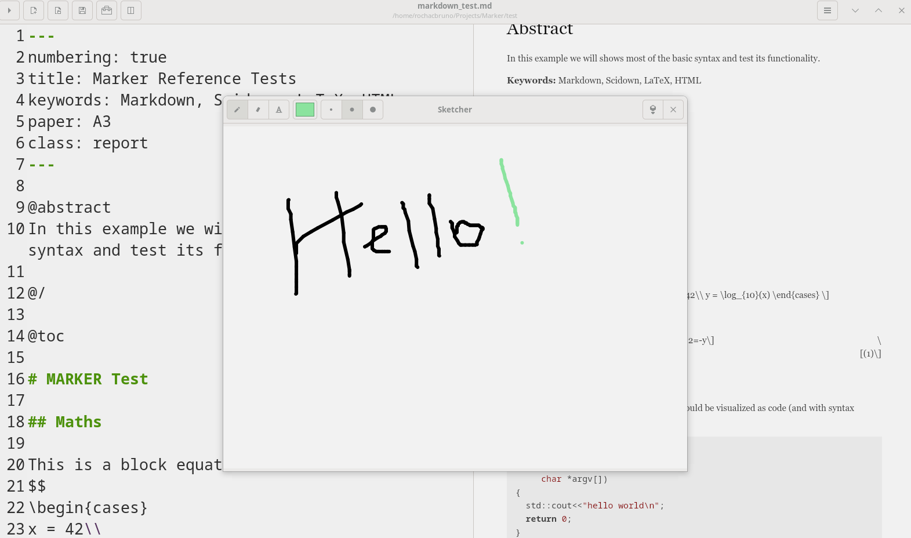

# Sketch Editor

Marker includes a built-in sketch editor that allows you to create drawings, diagrams, and illustrations directly within your markdown workflow. No need for external drawing applications - create and embed sketches seamlessly.



## Overview

The sketch editor provides a simple yet powerful drawing interface for creating:
- Quick diagrams and flowcharts
- Hand-drawn illustrations
- Annotations and markups
- Mathematical sketches
- Concept maps and mind maps

## Accessing the Sketch Editor

### Opening the Editor
- **Toolbar**: Click the sketch/draw button
- **Tools Menu**: Click Tools menu → **Sketch**
- **Keyboard**: Press **Ctrl+D**

### Interface Overview
The sketch editor opens in a separate window with:
- **Drawing canvas**: Central area for creating your sketch
- **Color palette**: Selection of colors for drawing
- **Tool options**: Brush size and drawing tools
- **Action buttons**: Save, clear, and close options

## Drawing Tools

### Pen Tool
- **Function**: Freehand drawing
- **Usage**: Click and drag to draw
- **Best for**: Signatures, organic shapes, annotations

### Brush Sizes
- **Small**: Fine details and text
- **Medium**: Standard drawing
- **Large**: Bold strokes and filling

### Color Selection
- **Basic colors**: Black, red, blue, green, yellow, etc.
- **Color picker**: Click to select active color
- **Default**: Black for standard diagrams

## Creating Sketches

### Basic Drawing Workflow
1. Open sketch editor (Ctrl+D)
2. Select color and brush size
3. Draw your sketch
4. Click **Save** to insert into document
5. Continue editing markdown

### Drawing Techniques

#### Diagrams
```
Tips for diagrams:
- Use straight lines for connectors
- Keep shapes simple and clear
- Use different colors for categories
- Add text annotations as needed
```

#### Flowcharts
```
Flowchart best practices:
- Draw boxes for processes
- Use arrows for flow direction
- Different shapes for different elements
- Color code by function
```

#### Mathematical Sketches
```
For math illustrations:
- Draw coordinate axes first
- Use consistent scale
- Label important points
- Add arrows for vectors
```

## Saving and Inserting

### Save Options
- **Save**: Inserts image at cursor position
- **Save As**: Choose location and filename
- **Format**: PNG format for compatibility

### Automatic Insertion
When you save a sketch:
1. Image is saved to your project directory
2. Markdown image syntax is inserted: ``
3. Preview updates immediately
4. Original sketch can be edited later

### File Management
- **Default location**: Same directory as markdown file
- **Naming**: Automatic timestamp-based names
- **Organization**: Consider creating `images/` subdirectory

## Editing Existing Sketches

### Modifying Sketches
1. Position cursor on image markdown
2. Open sketch editor (Ctrl+D)
3. Sketch editor may load existing image
4. Make modifications
5. Save overwrites original

### Version Control
- Keep original sketches in separate folder
- Use descriptive filenames
- Consider version numbers for iterations

## Use Cases

### Technical Documentation
- **System architecture diagrams**
- **Network topology sketches**
- **UI mockups and wireframes**
- **Database relationship diagrams**

### Educational Content
- **Mathematical graphs and plots**
- **Scientific illustrations**
- **Concept maps**
- **Process explanations**

### Creative Writing
- **Story maps and timelines**
- **Character relationship diagrams**
- **Scene sketches**
- **Plot structure visualizations**

### Note Taking
- **Meeting whiteboard captures**
- **Quick idea sketches**
- **Mind maps**
- **Visual notes**

## Best Practices

### Drawing Tips
- **Plan before drawing**: Rough sketch mentally first
- **Use layers conceptually**: Background first, details last
- **Keep it simple**: Clear communication over artistic detail
- **Consistent style**: Use same colors/styles throughout document

### File Organization
```
project/
├── document.md
├── images/
│   ├── sketch-01-overview.png
│   ├── sketch-02-details.png
│   └── sketch-03-conclusion.png
```

### Integration with Markdown
```markdown
## System Architecture

Below is a sketch of our system architecture:


As shown in the diagram, the components interact...
```

## Advanced Features

### Combining with Other Tools
- **Draw base in sketch editor**
- **Add text with markdown**
- **Enhance with mermaid for formal diagrams**
- **Use both for complete documentation**

### Export Considerations
- **PNG format**: Universal compatibility
- **Resolution**: Suitable for print and web
- **Transparency**: Supported for overlays
- **Size optimization**: Balance quality and file size

## Tips and Tricks

### Productivity
- **Quick sketches**: Don't over-polish
- **Reuse elements**: Copy similar sketches
- **Template sketches**: Create base drawings
- **Batch creation**: Draw multiple related sketches

### Quality
- **Zoom preview**: Check appearance at different sizes
- **Test export**: Verify in PDF/HTML output
- **Consistent sizing**: Maintain proportions
- **Clear labeling**: Add context in markdown

## Troubleshooting

### Common Issues

#### Sketch Not Saving
- Check file permissions
- Ensure valid save location
- Verify disk space
- Try "Save As" with explicit path

#### Image Not Displaying
- Verify file path in markdown
- Check image actually saved
- Ensure proper markdown syntax
- Preview refresh might be needed

#### Quality Issues
- Draw at larger size
- Use thicker lines for clarity
- Test different colors for contrast
- Consider vector alternatives for precision

### Performance
- Large sketches may slow preview
- Close sketch editor when not in use
- Clear canvas for new sketches
- Optimize images externally if needed

## Integration Examples

### With Mermaid Diagrams
```markdown
Here's a formal process flow:


And here's my hand-drawn annotation:


```

### With Mathematical Content
```markdown
The function $f(x) = x^2$ is illustrated below:


Note the vertex at the origin and symmetry about the y-axis.
```

The sketch editor in Marker bridges the gap between formal diagrams and quick illustrations, providing a flexible tool for visual communication within your markdown documents. Whether you need a quick diagram or a detailed illustration, the sketch editor keeps you in your writing flow while adding visual richness to your content.