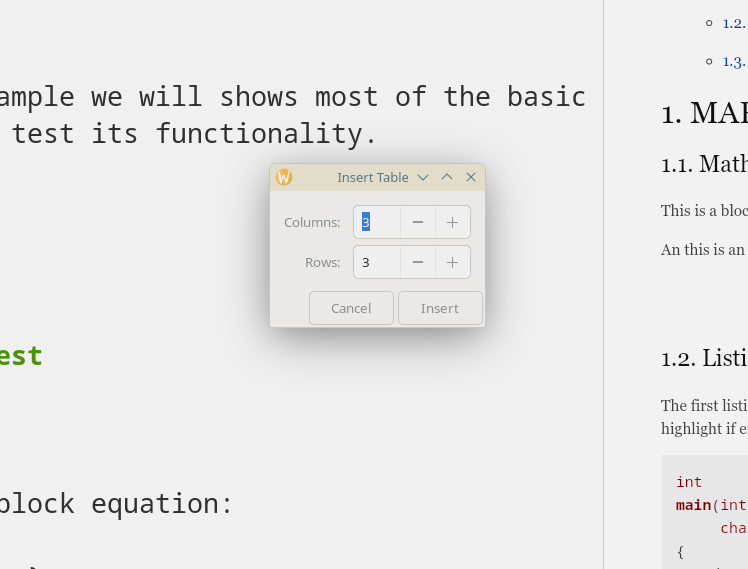

# Table Insertion

Marker provides powerful tools for creating and formatting markdown tables, including a visual table insertion dialog and automatic table alignment features.



## Overview

Working with tables in markdown can be tedious, but Marker simplifies this with:
- Visual table creation dialog
- Automatic column alignment
- Quick table formatting
- Easy table editing

## Creating Tables

### Table Insertion Dialog

Access the table insertion dialog through:
- **Tools Menu**: Click the tools button → **Insert Table**
- **Keyboard**: Press **Ctrl+Shift+T**

#### Dialog Options
- **Rows**: Number of table rows (2-100)
- **Columns**: Number of table columns (2-20)
- **Headers**: First row as header (enabled by default)
- **Alignment**: Left, center, or right for each column

### Basic Table Syntax

Markdown tables use pipes (`|`) and dashes (`-`):

```markdown
| Header 1 | Header 2 | Header 3 |
|----------|----------|----------|
| Cell 1   | Cell 2   | Cell 3   |
| Cell 4   | Cell 5   | Cell 6   |
```

Renders as:

| Header 1 | Header 2 | Header 3 |
|----------|----------|----------|
| Cell 1   | Cell 2   | Cell 3   |
| Cell 4   | Cell 5   | Cell 6   |

## Table Formatting

### Column Alignment

Control alignment with colons in the separator row:

```markdown
| Left | Center | Right |
|:-----|:------:|------:|
| L    |   C    |     R |
| Left | Center | Right |
```

Renders as:

| Left | Center | Right |
|:-----|:------:|------:|
| L    |   C    |     R |
| Left | Center | Right |

### Automatic Table Alignment

Use the table alignment feature:
- **Tools Menu**: Tools → **Align Table**
- **Keyboard**: Press **Ctrl+Shift+A**

#### Before Alignment
```markdown
|Name|Age|City|
|---|---|---|
|John Doe|25|New York|
|Jane Smith|30|Los Angeles|
```

#### After Alignment
```markdown
| Name       | Age | City        |
|------------|-----|-------------|
| John Doe   | 25  | New York    |
| Jane Smith | 30  | Los Angeles |
```

## Advanced Table Features

### Multi-line Cells

Use `<br>` for line breaks within cells:

```markdown
| Feature | Description |
|---------|-------------|
| Multi-line | First line<br>Second line<br>Third line |
| Standard | Single line content |
```

### Complex Content

Include various markdown elements in tables:

```markdown
| Type | Example | Result |
|------|---------|--------|
| **Bold** | `**text**` | **text** |
| *Italic* | `*text*` | *text* |
| `Code` | `` `code` `` | `code` |
| [Link](url) | `[text](url)` | [text](url) |
```

### Wide Tables

For tables with many columns:

```markdown
| ID | Name | Email | Phone | Department | Role | Status |
|----|------|-------|-------|------------|------|--------|
| 001 | John | j@co.com | 555-0001 | Sales | Manager | Active |
| 002 | Jane | jane@co.com | 555-0002 | IT | Developer | Active |
```

## Table Editing Tips

### Quick Creation Workflow
1. Press **Ctrl+Shift+T** to open dialog
2. Set rows and columns
3. Click OK to insert
4. Fill in content
5. Press **Ctrl+Shift+A** to align

### Efficient Editing
- **Tab navigation**: Use Tab to move between cells
- **Copy patterns**: Duplicate rows for similar data
- **Bulk edit**: Use find/replace for table-wide changes
- **Templates**: Save common table structures

### Adding Rows
```markdown
| Before adding |
|---------------|
| Row 1 |
| Row 2 |
<!-- Place cursor here and add: -->
| New Row |
```

### Adding Columns
1. Add pipe character to each row
2. Fill in new column data
3. Run table alignment (Ctrl+Shift+A)

## Styling and Formatting

### Emphasis in Tables

```markdown
| Normal | **Bold** | *Italic* | ***Both*** |
|--------|----------|----------|------------|
| Text | **Important** | *Emphasis* | ***Critical*** |
```

### Code in Tables

```markdown
| Language | Syntax | Example |
|----------|--------|---------|
| Python | `def func():` | `print("Hello")` |
| JavaScript | `function() {}` | `console.log()` |
| Markdown | `` `code` `` | `inline code` |
```

### Numbers and Data

```markdown
| Year | Revenue | Growth | Status |
|------|--------:|-------:|:------:|
| 2021 | $1.2M | - | ✓ |
| 2022 | $1.5M | 25% | ✓ |
| 2023 | $2.1M | 40% | ✓ |
| 2024 | $2.8M | 33% | ⚡ |
```

## Best Practices

### Table Design
- **Keep it simple**: Don't overload tables
- **Use headers**: Always include descriptive headers
- **Consistent alignment**: Align numbers right, text left
- **Reasonable width**: Consider readability

### Content Guidelines
- **Concise entries**: Keep cells brief
- **Consistent format**: Same data type per column
- **Clear headers**: Descriptive but short
- **Visual hierarchy**: Use formatting sparingly

### Performance
- **Limit size**: Very large tables impact performance
- **Consider alternatives**: Use lists for simple data
- **Break up data**: Multiple smaller tables
- **Export testing**: Check table rendering in exports

## Common Use Cases

### Data Comparison

```markdown
| Feature | Product A | Product B | Product C |
|---------|:---------:|:---------:|:---------:|
| Price | $99 | $149 | $199 |
| Storage | 10GB | 50GB | 100GB |
| Support | Email | Phone | Priority |
| Users | 1 | 5 | Unlimited |
```

### Project Status

```markdown
| Task | Assignee | Status | Due Date | Progress |
|------|----------|--------|----------|----------|
| Design | Alice | ✅ Complete | Jan 15 | 100% |
| Development | Bob | 🔄 In Progress | Jan 30 | 75% |
| Testing | Carol | ⏸️ Pending | Feb 15 | 0% |
| Deploy | Dave | ⏸️ Pending | Feb 28 | 0% |
```

### API Documentation

```markdown
| Endpoint | Method | Parameters | Response |
|----------|--------|------------|----------|
| `/users` | GET | `limit`, `offset` | User array |
| `/users/{id}` | GET | `id` | User object |
| `/users` | POST | `name`, `email` | Created user |
| `/users/{id}` | DELETE | `id` | Success status |
```

## Troubleshooting

### Common Issues

#### Table Not Rendering
- Check pipe alignment
- Ensure separator row has dashes
- Verify no missing pipes
- Look for special characters

#### Alignment Not Working
- Select entire table before aligning
- Ensure valid table syntax
- Check for merged cells (not supported)
- Remove extra spaces

#### Export Problems
- Test in preview first
- Check PDF/HTML rendering
- Simplify complex formatting
- Consider export format limitations

## Tips and Tricks

### Quick Tables
For simple tables, use the insertion dialog with these shortcuts:
- 2x2 for pros/cons lists
- 3x3 for small comparisons  
- Nx2 for definition lists

### Table Templates
Save commonly used table structures:
```markdown
<!-- Status table template -->
| Component | Status | Last Check | Notes |
|-----------|:------:|------------|-------|
| | ✅ | | |
| | ❌ | | |
| | ⚠️ | | |
```

### Keyboard Efficiency
- **Ctrl+Shift+T**: Insert table
- **Tab**: Navigate cells while editing
- **Ctrl+Shift+A**: Align table
- **Ctrl+C/V**: Copy table rows

The table features in Marker transform the traditionally tedious task of creating markdown tables into a smooth, efficient process, allowing you to focus on your content rather than formatting.