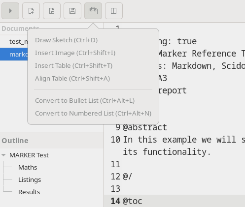
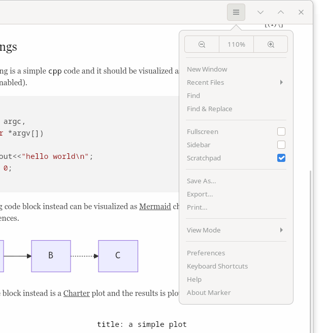

# Toolbar

Marker's toolbar provides instant access to frequently used features, keeping essential tools just one click away. The toolbar adapts based on your current view mode and preferences.

## Overview

The toolbar is located at the top of the Marker window and includes:
- **File operations**: New, open, save
- **View controls**: Sidebar, view mode toggle
- **Editor options**: Spell check, line numbers, word wrap
- **Tools menu**: Insert functions and utilities
- **Application menu**: Preferences and settings

## Toolbar Buttons

### Left Side Controls

#### Sidebar Toggle
- **Icon**: Three-line hamburger menu
- **Function**: Show/hide sidebar with outline and scratchpad
- **Shortcut**: F9 or Ctrl+Shift+B
- **State**: Pressed when sidebar visible

#### New Document
- **Icon**: Document with plus sign
- **Function**: Create new document in current window
- **Shortcut**: Ctrl+N
- **Tooltip**: "New file (Ctrl+N)"

#### Open File
- **Icon**: Folder icon
- **Function**: Open file dialog
- **Shortcut**: Ctrl+O
- **Tooltip**: "Open file (Ctrl+O)"

#### Save File
- **Icon**: Floppy disk
- **Function**: Save current document
- **Shortcut**: Ctrl+S
- **Tooltip**: "Save file (Ctrl+S)"
- **State**: Enabled when document modified

### Tools Menu

Click the tools button to access:

#### Insert Functions
- **Insert Image**: Add image reference (Ctrl+Shift+I)
- **Insert Table**: Open table creation dialog (Ctrl+Shift+T)
- **Align Table**: Format existing table (Ctrl+Shift+A)
- **Insert Link**: Add hyperlink (Ctrl+K)

#### List Operations
- **Bullet List**: Create unordered list (Ctrl+Alt+L)
- **Numbered List**: Create ordered list (Ctrl+Alt+N)

#### Drawing Tool
- **Sketch**: Open sketch editor (Ctrl+D)

### View Mode Controls

#### View Mode Toggle
- **Icon**: Split view icon
- **Function**: Cycle through view modes
- **Shortcut**: Ctrl+Shift+L
- **Modes**: Editor → Preview → Dual Pane → Dual Window

#### Current Mode Indicator
The icon changes based on active view mode:
- Single document (editor only)
- Eye icon (preview only)
- Split view (dual pane)
- Multiple windows (dual window)

### Editor Options

These toggle buttons affect the editor display:

#### Spell Check Toggle
- **Icon**: ABC with checkmark
- **Function**: Enable/disable spell checking
- **Shortcut**: F7
- **State**: Highlighted when active

#### Line Numbers Toggle
- **Icon**: Numbered lines
- **Function**: Show/hide line numbers
- **Default**: Enabled
- **State**: Highlighted when visible

#### Word Wrap Toggle
- **Icon**: Text wrapping arrow
- **Function**: Enable/disable text wrapping
- **Default**: Enabled
- **State**: Highlighted when active

#### Scroll Sync Toggle
- **Icon**: Circular arrows
- **Function**: Synchronize editor/preview scrolling
- **State**: Only visible in dual pane modes
- **Default**: Enabled

### Right Side Controls

#### Application Menu
- **Icon**: Gear/cog icon
- **Function**: Access main application menu
- **Contents**: 
  - Recent Files
  - View Modes
  - Preferences
  - Keyboard Shortcuts
  - About

## Customization

### Toolbar Visibility
- Always visible in default configuration
- Adjusts based on window width
- Icons only (no text labels) for space efficiency

### Context Sensitivity
The toolbar adapts based on:
- **View mode**: Some buttons only in certain modes
- **Document state**: Save button indicates unsaved changes
- **File type**: Tools available for markdown files

### Visual Feedback
- **Hover effects**: Buttons highlight on mouse over
- **Pressed state**: Toggle buttons show active state
- **Tooltips**: Helpful hints with keyboard shortcuts
- **Disabled state**: Unavailable actions are grayed out

## Workflow Integration

### Quick Document Creation
1. Click New (or Ctrl+N)
2. Start typing immediately
3. Click Save when ready (or Ctrl+S)
4. Continue editing

### View Mode Switching
1. Click view mode button repeatedly
2. Cycles through all available modes
3. Or use Ctrl+1, Ctrl+2, Ctrl+3, Ctrl+4

### Table Workflow
1. Click Tools → Insert Table
2. Configure rows and columns
3. Fill in content
4. Click Tools → Align Table

### Image Insertion
1. Position cursor where image should go
2. Click Tools → Insert Image
3. Select image file
4. Markdown syntax inserted automatically

## Tips and Tricks

### Efficient Usage
- **Learn shortcuts**: Hover to see keyboard shortcuts
- **Use toolbar for discovery**: Find features you didn't know
- **Combine with keyboard**: Toolbar for occasional use
- **Right-click**: Some buttons have context menus

### Common Patterns
- **Toggle sidebar**: Quick outline access
- **View mode cycling**: Find your preferred layout
- **Tools menu**: Central location for insert operations
- **Save indicator**: Watch for unsaved changes

### Space Management
- **Sidebar control**: Hide for more editor space
- **Fullscreen mode**: F11 hides everything but content
- **View modes**: Choose based on screen size
- **Minimal UI**: Toolbar is only chrome visible

## Platform Notes

### GTK Integration
- Native GTK widgets
- Follows system theme
- Respects dark mode settings
- Standard button behaviors

### Responsiveness
- Instant button response
- No lag on operations
- Background tasks don't block UI
- Visual feedback immediate

## Accessibility

### Keyboard Access
- All toolbar functions have keyboard shortcuts
- Tab navigation through buttons
- Space/Enter to activate
- Escape to cancel operations

### Visual Indicators
- Clear icon designs
- Sufficient contrast
- State indicators visible
- Tooltips for clarity

## Troubleshooting

### Buttons Not Working
- Check if document is saved
- Verify markdown file type
- Ensure not in preview-only mode
- Restart if unresponsive

### Missing Buttons
- Check view mode (some mode-specific)
- Verify window width (may hide if too narrow)
- Look in menus for same functions
- Reset preferences if needed

### Performance
- Toolbar operations are instant
- If slow, check document size
- Large files may impact some operations
- Consider splitting very large documents

The toolbar in Marker provides an efficient command center for your markdown editing workflow, balancing quick access with a clean, uncluttered interface that keeps the focus on your content.