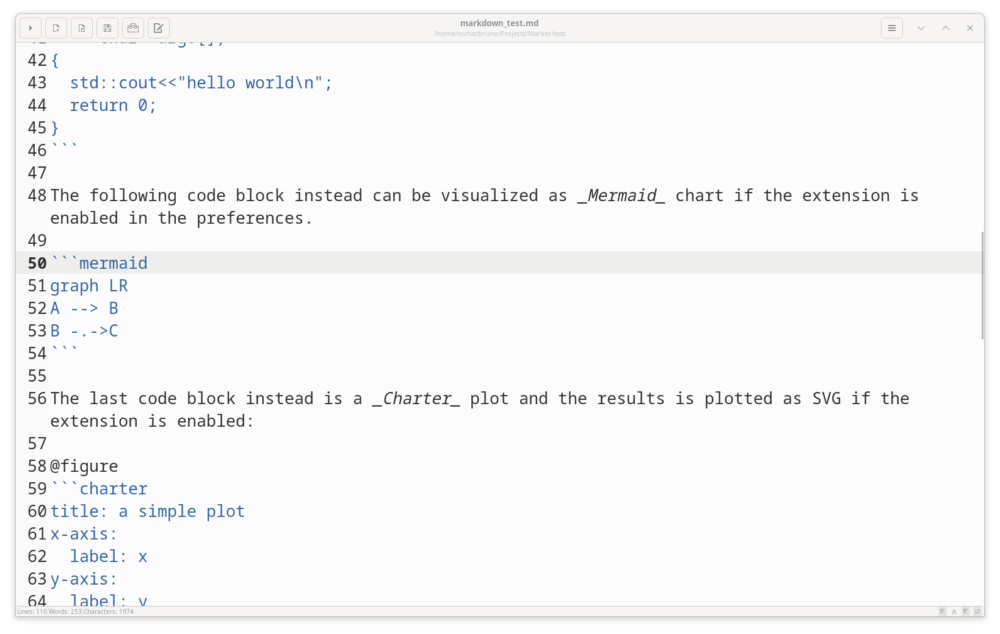
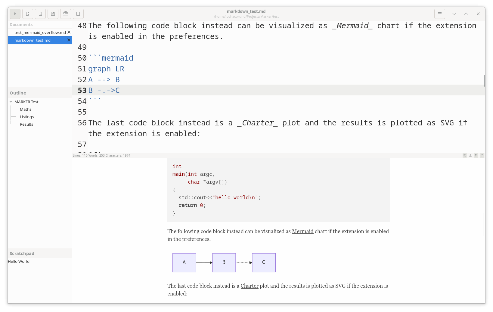

# View Modes

Marker offers multiple view modes to accommodate different writing styles and screen configurations. Switch seamlessly between layouts to find the perfect setup for your current task.

## Available View Modes

### Editor Only
Focus entirely on writing without any distractions. The preview pane is hidden, giving you the full window for your markdown editor.

- **Best for**: Initial drafting, code-heavy documents, distraction-free writing
- **Keyboard shortcut**: Ctrl+1
- **Features**: Full screen editor, syntax highlighting, all editor tools available

### Preview Only
View only the rendered markdown output without the editor visible. Perfect for reviewing your formatted document.

- **Best for**: Reading, reviewing final output, presentations
- **Keyboard shortcut**: Ctrl+2
- **Features**: Full window preview, zoom controls, smooth scrolling

### Dual Pane Horizontal
The classic side-by-side layout with editor on the left and preview on the right.

- **Best for**: Most writing tasks, immediate preview feedback, balanced workflow
- **Keyboard shortcut**: Ctrl+3
- **Features**: Adjustable pane widths, optional scroll synchronization

### Dual Pane Vertical
Editor positioned above the preview in a stacked layout.

- **Best for**: Wide screens, vertical monitors, document structure focus
- **Keyboard shortcut**: Not available (use menu or Ctrl+Shift+L to cycle)
- **Features**: Full-width editor, adjustable pane heights

### Dual Window
Separate windows for editor and preview, allowing maximum flexibility.

- **Best for**: Multiple monitors, comparing versions, maximum screen usage
- **Keyboard shortcut**: Ctrl+4
- **Features**: Independent window positioning, multi-monitor support

## Switching View Modes

### Quick Switching
- **Cycle through modes**: Ctrl+Shift+L
- **Direct selection**: Ctrl+1, Ctrl+2, Ctrl+3, Ctrl+4
- **Menu access**: Gear menu → View Modes
- **Toolbar button**: Click view mode toggle button

### View Mode Memory
- Last used view mode is remembered between sessions
- Each document can have its own view mode
- Default view mode configurable in preferences

## View Mode Features

### Editor Only Benefits
- **Maximum writing space**: No screen real estate lost to preview
- **Better performance**: No live rendering overhead
- **Focus mode**: Eliminates visual distractions
- **Faster startup**: Quicker loading for large documents

### Preview Integration
In dual pane modes:
- **Live updates**: Preview refreshes as you type
- **Scroll synchronization**: Optional linked scrolling
- **Click to edit**: Click preview to jump to source location
- **Zoom controls**: Adjust preview size independently

### Layout Adjustments
For dual pane modes:
- **Drag to resize**: Adjust the divider between panes
- **Minimum sizes**: Panes maintain usable minimums
- **Save positions**: Layout preferences remembered
- **Reset options**: Return to default sizes

## Choosing the Right Mode

### By Task Type

#### Writing New Content
- **Editor Only**: For initial drafts and brainstorming
- **Dual Pane Horizontal**: For content requiring formatting checks

#### Reviewing Documents
- **Preview Only**: For final review and reading
- **Dual Window**: For comparing with references

#### Technical Documentation
- **Dual Pane Horizontal**: For code blocks and formatting
- **Dual Pane Vertical**: For long code snippets

#### Academic Writing
- **Dual Pane**: For equations and references
- **Editor Only**: For focused writing sessions

### By Screen Size

#### Small Screens (Laptops)
- **Editor Only**: Maximum space utilization
- **Preview Only**: For reading/reviewing
- **Avoid**: Dual pane modes may be cramped

#### Standard Monitors
- **Dual Pane Horizontal**: Optimal balance
- **Editor Only**: For focused sessions
- **Dual Window**: If second monitor available

#### Wide/Ultra-wide Monitors
- **Dual Pane Horizontal**: Excellent use of width
- **Dual Pane Vertical**: Alternative layout option
- **Dual Window**: Side-by-side on same screen

#### Vertical Monitors
- **Dual Pane Vertical**: Natural fit
- **Editor Only**: Full height utilization
- **Preview Only**: Document reading

## Workflow Integration

### Quick Preview Checks
1. Write in Editor Only (Ctrl+1)
2. Quick preview check (Ctrl+2)
3. Return to editor (Ctrl+1)
4. Continue writing

### Side-by-Side Editing
1. Start in Dual Pane (Ctrl+3)
2. Write and preview simultaneously
3. Adjust pane sizes as needed
4. Toggle scroll sync if desired

### Multi-Monitor Setup
1. Open Dual Window mode (Ctrl+4)
2. Move preview to second monitor
3. Maximize both windows
4. Work with full-screen editor and preview

## Tips and Tricks

### Efficiency Tips
- **Learn shortcuts**: Memorize Ctrl+1/2/3/4
- **Use cycling**: Ctrl+Shift+L for quick changes
- **Set defaults**: Configure preferred mode in settings
- **Task-based switching**: Change modes based on current task

### Performance Optimization
- **Large files**: Use Editor Only for better performance
- **Complex previews**: Disable scroll sync for smoother editing
- **Resource usage**: Preview Only uses less CPU than dual modes
- **Quick switches**: Mode changes are instant

### Customization
- **Toolbar access**: Add view mode button to toolbar
- **Menu organization**: Access via gear menu
- **Keyboard remapping**: Customize shortcuts if needed
- **Session persistence**: Modes saved per document

## Common Use Cases

### Blog Writing
1. Draft in Editor Only
2. Switch to Dual Pane for formatting
3. Final review in Preview Only
4. Export when satisfied

### Documentation
1. Dual Pane for immediate feedback
2. Editor Only for long code blocks
3. Preview Only for navigation testing
4. Dual Window for reference viewing

### Note Taking
1. Editor Only for quick capture
2. Dual Pane for organized notes
3. Preview Only for review
4. Adjust as needed

### Academic Papers
1. Dual Pane for equations and figures
2. Editor Only for writing sections
3. Preview Only for proofreading
4. Dual Window for citations

## Troubleshooting

### Mode Not Switching
- Check if keyboard shortcuts are working
- Try menu selection instead
- Restart Marker if unresponsive
- Verify no modal dialogs open

### Layout Issues
- Reset pane sizes via menu
- Check window minimum size
- Ensure adequate screen resolution
- Try different mode and switch back

### Performance Problems
- Switch to Editor Only for large files
- Disable scroll sync if laggy
- Close unnecessary applications
- Check system resources

The variety of view modes in Marker ensures that whether you're drafting, editing, reviewing, or publishing, you have the perfect layout for your current workflow. Experiment with different modes to discover what works best for your writing style.