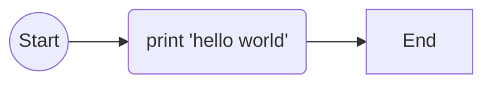

@abstract
In this document I will illustrate few simple examples of **SciDown** the scientific extension of **MarkDown**. 

The purpose of this language is to add few basic, but yet missing, functionality to *MarkDown* to publish scientific and scholar documents.

All the basic *MarkDown* syntax still work on *SciDown*. 
@/

# Floating Elements

In this section I will show how to use floating elements, such as:

 * Figure
 * Listing
 * Table
 * Equation

## Figure 


 
The following code (#code:test) shows a simple code:

@listing(code:test)
```cpp
int main(int argc, char *argv[])
{
  std::cout<<"Hello World\n";
  return 0;
}
```
@caption(Simple test code.
@/

Figure (#code:diagram) shows the  diagram of the code presented in the listing (#code:test):

@figure(code:diagram)

@caption(Simple diagram)
@/

