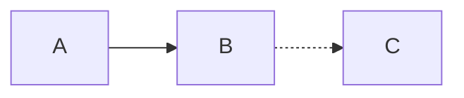

@abstract
In this example we will shows most of the basic syntax and test its functionality. 

@/

@toc

# MARKER Test

## Maths

This is a block equation:
$$
\begin{cases}
x = 42\\
y = \log_{10}(x)
\end{cases}
$$

An this is an inline equation: $x\in A$.

@equation
(x+1)^2=-y
@/

## Listings

The first listing is a simple ```cpp``` code and it should be visualized as code (and with syntax highlight if enabled).

```cpp
int 
main(int argc, 
     char *argv[])
{
  std::cout<<"hello world\n";
  return 0;
}
```

The following code block instead can be visualized as _Mermaid_ chart if the extension is enabled in the preferences.



The last code block instead is a _Charter_ plot and the results is plotted as SVG if the extension is enabled:

@figure
```charter
title: a simple plot
x-axis:
  label: x
y-axis:
  label: y
plot:
  x range: -3 3 60
  y math: exp(-(x^2))
  label: gausian
```
@caption(A simple plot)
@/

## Results

For the **Preview**:

| Test               | Status |
| :----------------- | :----- |
| Basic MD           | Ok     |
| Block equation     | Ok     |
| KaTeX settings     | Ok     |
| Inline equation    | Ok     |
| Code listing       | Ok     |
| highlight settings | Ok     |
| Mermaid graph      | Ok     |
| Mermaid settings   | Ok     |
| Figure caption     | Ok     |
| Numbering          | Ok     |
| Charter            | Ok     |
| Charter preferences| OK     | 


For the **Editor**:


| Test               | Status |
| :----------------- | :----- |
| Lines number       | Ok     |
| Wrap Test          | Ok     |
| Right Margin       | Ok     |
| Spell check        | Ok     |
| Current line HL    | Ok     |
| Syntax highlight   | Ok     |
| Editor theme       | Ok     |
| Tabulation settings| Ok     |
| Sketcher           | Ok     |
| Scroll position    | Ok     |


