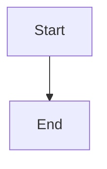
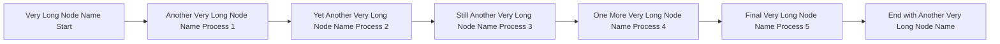
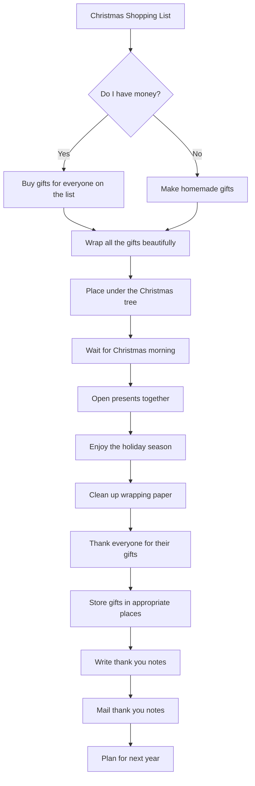

# Mermaid Diagram Overflow Test

## Small Diagram

```mermaid
graph TD
    A[Start] --> B[End]
```

## Large Horizontal Diagram

```mermaid
graph LR
    A[Very Long Node Name Start] --> B[Another Very Long Node Name Process 1]
    B --> C[Yet Another Very Long Node Name Process 2]
    C --> D[Still Another Very Long Node Name Process 3]
    D --> E[One More Very Long Node Name Process 4]
    E --> F[Final Very Long Node Name Process 5]
    F --> G[End with Another Very Long Node Name]
```

## Complex Diagram

```mermaid
graph TD
    A[Christmas Shopping List] --> B{Do I have money?}
    B -->|Yes| C[Buy gifts for everyone on the list]
    B -->|No| D[Make homemade gifts]
    C --> E[Wrap all the gifts beautifully]
    D --> E
    E --> F[Place under the Christmas tree]
    F --> G[Wait for Christmas morning]
    G --> H[Open presents together]
    H --> I[Enjoy the holiday season]
    I --> J[Clean up wrapping paper]
    J --> K[Thank everyone for their gifts]
    K --> L[Store gifts in appropriate places]
    L --> M[Write thank you notes]
    M --> N[Mail thank you notes]
    N --> O[Plan for next year]
```