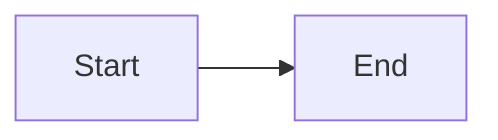

# Real Header 1

This is some text.

## Real Header 2

Here's a code block that should not appear in outline:

```
# This is NOT a header
## This is also NOT a header
```



### Real Header 3

And here's an indented code block:

    # This is NOT a header either
    ## Neither is this

#### Real Header 4


| Header 1 | Header 2 |
| -------- | -------- |
| s        | s        |
| s        | s        |


Another fenced code block with different syntax:

~~~
# Fake header in tildes
~~~

##### Real Header 5

Some more content here.

###### Real Header 6

The end.
